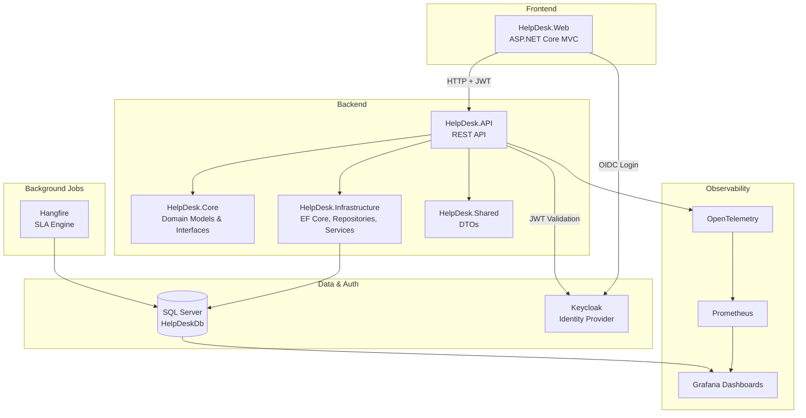

# HelpDesk Pro — Internal IT Ticketing System

An enterprise-grade internal help desk and ticketing system built as a Final Mini Project for the Standard Bank Namibia Software Development Internship. HelpDesk Pro simulates a real-world IT support platform similar to Jira Service Management or Zendesk, with role-based dashboards, SLA automation, and full observability.

## Table of Contents
- [Overview](#overview)
- [Architecture](#architecture)
- [Tech Stack](#tech-stack)
- [Key Features](#key-features)
- [Project Structure](#project-structure)
- [Getting Started](#getting-started)
- [Roles & Permissions](#roles--permissions)
- [Observability](#observability)
- [Known Limitations & Future Work](#known-limitations--future-work)

---

## Overview

Employees can raise IT support tickets (hardware, software, network, access, email issues). Technicians pick up and resolve tickets. Team Leads manage assignment and team workload. Admins have full oversight with organization-wide analytics.

The system enforces a real ticket lifecycle with SLA deadlines, automatic breach detection via background jobs, escalation rules, and role-based data visibility (e.g. internal notes are hidden from the ticket requester).

---

## Architecture



**Clean Architecture layering:**
This ensures business logic in `Core` never depends on how data is stored or how the API is exposed — the database or frontend could be swapped without touching domain logic.

---

## Tech Stack

| Layer | Technology |
|---|---|
| Frontend | ASP.NET Core MVC, Razor Views, vanilla JS |
| Backend API | ASP.NET Core Web API |
| Database | SQL Server, Entity Framework Core |
| Authentication | Keycloak (OpenID Connect + JWT Bearer) |
| Background Jobs | Hangfire |
| Observability | OpenTelemetry, Prometheus, Grafana |
| Containerization | Docker Compose (Keycloak, Redis, Prometheus, Loki, Tempo, Grafana) |
| Charting | Chart.js |

---

## Key Features

- **Full ticket lifecycle** with a proper state machine (Open → Assigned → In Progress → Resolved → Closed), including validated transitions and re-opening
- **SLA engine** — automatic breach detection via a Hangfire recurring job that checks resolution deadlines every few minutes
- **Escalation** — manual escalation by staff, or automatic escalation on SLA breach; escalating a ticket raises its priority and flags it for review
- **Role-based dashboards** — Employee, Technician, Team Lead, and Admin each see a purpose-built dashboard with real data
- **Role-based data visibility** — internal notes on tickets are hidden from Employees but visible to staff, enforced at both the API and UI layer
- **Audit trail** — every status change, assignment, and escalation is recorded in an immutable history table
- **Real analytics** — Reports dashboard with live SQL aggregation (resolution rate, weekly/monthly trends, satisfaction score)
- **Full observability** — three Grafana dashboards: Executive (SQL-based business metrics), Technician (workload), and Operations (Prometheus-based system health)

---

## Project Structure

HelpDesk/
├── src/
│ ├── HelpDesk.API/ # REST API, controllers, auth config
│ ├── HelpDesk.Web/ # MVC frontend
│ ├── HelpDesk.Core/ # Entities, enums, interfaces
│ ├── HelpDesk.Infrastructure/ # EF Core, repositories, services
│ └── HelpDesk.Shared/ # DTOs shared between API and Web
├── tests/
│ └── HelpDesk.Tests/
├── infrastructure/
│ ├── prometheus.yml
│ └── tempo.yml
├── docker-compose.yml
└── README.md


---

## Getting Started

### Prerequisites
- .NET 8 SDK
- SQL Server (local instance or Docker)
- Docker Desktop (for Keycloak, Prometheus, Loki, Tempo, Grafana)

### Setup

1. **Start supporting services**
```bash
   docker-compose up -d
```

2. **Configure Keycloak** — create a `helpdesk` realm, a confidential client `helpdesk-app`, four realm roles (`Employee`, `Technician`, `TeamLead`, `Admin`), and test users. See `docs/keycloak-setup.md` *(optional — add this if you write one)*.

3. **Update connection strings** in `src/HelpDesk.API/appsettings.json` and `src/HelpDesk.Web/appsettings.json` with your SQL Server and Keycloak client secret.

4. **Run the API** (applies migrations and seeds test data automatically on startup)
```bash
   dotnet run --project src/HelpDesk.API
```

5. **Run the Web app**
```bash
   dotnet run --project src/HelpDesk.Web
```

6. Open `https://localhost:7130` and log in with a seeded test user.

---

## Roles & Permissions

| Action | Employee | Technician | Team Lead | Admin |
|---|:---:|:---:|:---:|:---:|
| Create ticket | ✅ | ✅ | ✅ | ✅ |
| View own tickets | ✅ | ✅ | ✅ | ✅ |
| View all tickets | ❌ | ❌ | ✅ | ✅ |
| Assign tickets | ❌ | ❌ | ✅ | ✅ |
| Update ticket status | ❌ | ✅ | ✅ | ✅ |
| Escalate ticket | ❌ | ✅ | ✅ | ✅ |
| Add internal notes | ❌ | ✅ | ✅ | ✅ |
| View internal notes | ❌ | ✅ | ✅ | ✅ |
| View team workload | ❌ | ❌ | ✅ | ✅ |
| Manage categories | ❌ | ❌ | ❌ | ✅ |
| View organization reports | ❌ | ❌ | ✅ | ✅ |

---

## Observability

Three Grafana dashboards demonstrate full-stack monitoring:

1. **Executive Dashboard** (SQL Server data source) — total open tickets, SLA breaches this week, tickets by category, tickets by priority
2. **Technician Dashboard** (SQL Server data source) — open tickets per technician, resolved this week, tickets by status
3. **Operations Dashboard** (Prometheus data source, via OpenTelemetry) — API request rate, response time (p95), active requests, exceptions thrown

This demonstrates both **business-level** monitoring (what matters to a manager) and **system-level** monitoring (what matters to an SRE/DevOps engineer) from the same application.

---

## Known Limitations & Future Work

Being transparent about scope decisions made under a one-month timeline:

- **Multi-tenancy** is modeled in the data (every entity has a `TenantId`), but the frontend currently hardcodes a single tenant ID rather than supporting tenant switching/onboarding.
- **Profile editing and notification preferences** on the Settings page are UI-complete but not yet persisted to the database.
- **Redis caching** was planned but not implemented — ticket list queries currently hit SQL Server directly on every request.
- **Password change / 2FA** buttons on Settings are placeholders — these would be delegated to Keycloak's account management in a production setup.
- **CI/CD pipeline** — *(update this section once built)*.

These were deliberate trade-offs to prioritize a complete, working core experience (auth, ticket lifecycle, dashboards, observability) over breadth of partially-built features.

---

## Author

Ewaldine Eises — Software Engineer